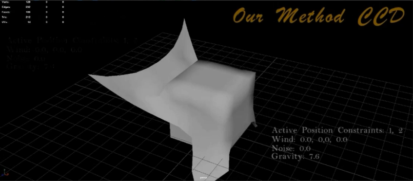
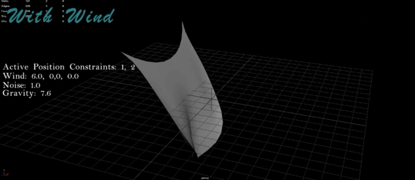
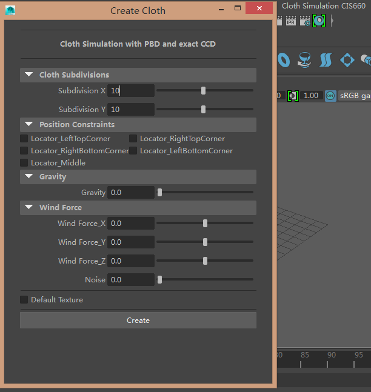

Cloth-simulation-based-on-exact-CCD
======================
This is a Maya plugin of cloth simulation implemented by *Jiawei Wang* and me. To see the video demo, click [here](https://vimeo.com/234173469).

To load this plugin into Maya, please copy all the files in the **bin** folder into the **bin** folder under your Maya installation path. Then in Maya, you can click the *Windows -> Settings/Preferences -> Plug-in Manager* to load the **ClothSolverPlugins.py**.If it succeeds, you will see the GUI of the plugin.    
        
For this cloth plugin, we implemented the following features.

#### Position Constraints Cloth simulation resolution     
For the cloth simulation, we use the open source code of [tw_cloth_solver](https://github.com/timmwagener/tw_cloth_solver) as reference. We change the resolution and collision detection part of the source code and optimize the architecture of the source code.

#### Collision Detection      
The collision detection part is implemented according to the SigGraph Paper of [**Efficient Geometrically Exact Continuous Collision Detection**](http://www.cs.ubc.ca/labs/imager/tr/2012/ExactContinuousCollisionDetection/BEB2012.html) by **Tyson Brochu**,etc.     
   

#### Gravity and Wind force effect   
Based on the source code, we add wind force and gravity to the cloth to create dynamical effect for cloth simulation   

#### User Interface Design
We implement a user interface with Python for our plugin. The interface will automatically appear in the menu after the plugin is loaded.    
       

We also upload some .fbx files.You can directly load those into Maya to see the rendering results.

